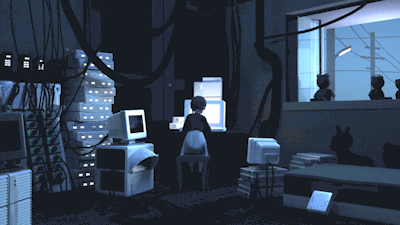

<!-- # Howdy! Welcome to my page! 👋 -->
</img>

# Hi There 👋 , I am Ayman Mostafa 
I am a Front-end developer based from Egypt with a Bachelor of Management Informations Systems (MIS) degree from the [El Shorouk Academy (Egypt)](https://hicit.sha.edu.eg/department-mis.php) and more than 5 years of IT experience. I love building and seeing projects come to life. I love front-end development the most! Currently I am looking for new challenges.

🌱 **Learning**: Currently sharpening my JavaScript, TypeScript and React skills. 

## How to reach me 📫:

    
    
    

# Skills | Frameworks

  <a href="https://github.com/Ayman91">
  
  

# Projects

### project name | July 2022 | [Repo](https://github.com/)
_Work in progress.._
 

* Powered by React, Typescript. 
* This project is based off of Roadside Coder's Typescript tutorial from FreeCodeCamp.org.
* This is a to-do list app that has button animations, draggable elements that were built using built-in React hooks and custom CSS
* Users can add tasks, delete and edit said tasks as well as cross them out once done.
 

